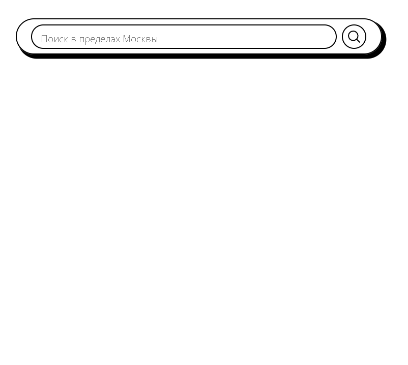

# Запуск

Для запуска всех контейнеров вводим в командную консоль комманду:

``` bash
docker-compose up -d
```

Откываем bash консоль в контейнере php:

``` bash
docker-compose exec -u 0 php-cli bash
```

Устанавливаем зависимосисти 

``` bash
composer install
```

Меняем права доступа к папке storage и её содержимому:

``` bash
chmod -R 777 storage 
```

Или

``` bash
sudo chmod -R 777 storage 
```

В этом же терминале запускаем миграции:

``` bash
php artisan migrate
```

Устанавливаем node пакеты:

``` bash
docker-compose exec node npm install
```

Запускаем node командой:

``` bash
docker-compose exec node npm run dev
```

Открываем в браузере http://localhost:8080 и видим:



В появившееся поле можно вводить любой текст. Через некоторое время после нажатия на кнопку поиска вы увидите результат поиска. Поиск происходит в пределах Москвы.

PS: Я убрал .env из .gitignor, так что заморачиваться с паролям к базе данных и ключём к апи геокодера не нужно.